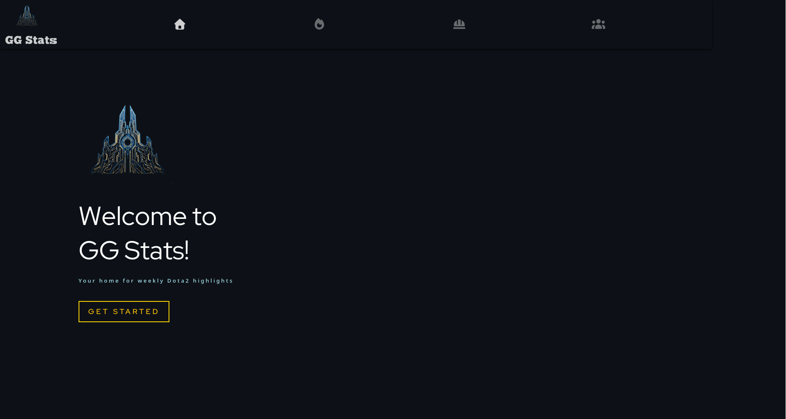

# GG Stats

A full-stack project for aggregating and visualizing **professional Dota 2 statistics**.
The backend is a Spring Boot 3.5 application with PostgreSQL, Flyway, Spring Batch, and Actuator.
The frontend is built with React 19.

<p align="center">
  
</p>

---

## Tech Stack

* **Backend**: Spring Boot 3.5 (Web, Data JPA, Batch, Actuator)
* **Database**: PostgreSQL, Flyway migrations
* **Frontend**: React 19 + Vite
* **Build & Coverage**: Maven, JaCoCo
* **Observability**: Spring Boot Actuator (health, metrics), structured logging (to `/tmp/`)

**Project structure highlights**:

* `src/main/java/` – Spring Boot backend
* `src/main/resources/application.properties` – App config (DB, actuator, etc.)
* `compose.yaml` – PostgreSQL service for local development
* `frontend/` – React + Vite frontend

---

## Prerequisites

* Java 24 (see `pom.xml` → `<java.version>24</java.version>`)
* Maven 3.9+
* Node.js 20+ and npm (for frontend)
* Docker 24+ and Docker Compose plugin
* Git lfs for downloading the prepopulated database dump(./local/dump.sql)

---

## Running the Backend Locally

The application uses **Spring Boot Docker Compose support** (`spring-boot-docker-compose`).
Starting the app can automatically spin up the PostgreSQL container defined in `compose.yaml`.

**Default environment values** (from `application.properties`):

* **DB URL**: `jdbc:postgresql://localhost:5432/dota_stats`
* **DB User**: `myuser`
* **DB Password**: `secret`
* **Spring Security (dev only)**: `admin` / `admin`
* **Actuator web exposure**: `health`, `metrics`

---

## Building & Running the App

### 0. Download database dump from Git lfs
```
git lfs install
git lfs pull
```

### 1. Build Frontend image

```bash
docker build -t gg-stats-frontend:local ./frontend
```

### 2. Build Spring Boot App image

```bash
./mvnw spring-boot:build-image
```

### 3. Run with Docker Compose

```bash
docker compose -f compose.yaml -f compose.app.yaml -f compose.frontend.yaml up -d
```

Frontend will be available at:
👉 `https://localhost:8081`

---

## API Documentation (Summary)

**Controllers under** `src/main/java/com/abe/gg_stats/controller/`:

### `/api/aggregations`

* `POST /api/aggregations/refresh`
  Triggers aggregation refresh job. (Auth may be required; default: `admin` / `admin` in dev)

### `/heroes`

* `GET /heroes` → Returns `HeroDto[]`
* `GET /heroes/{heroId}/popular-items`
  Query params:

  * `limit` (default 12)
  * `playersLimit` (default 10)
    Returns popular items by game phase + top players for the hero.

### `/highlights`

* `GET /highlights`
  Query params: `bucket` (default `patch`), `value`, `limit` (default 5), `sort` (default `lift`), `weekOffset` (default 0)
  Returns `HighlightsDto` or 400 if unavailable.

* `GET /highlights/pairs`
  Query params: `view` (default `synergy`), `weekOffset` (default 0), `limit` (default 10)
  Returns `HighlightsDuoDto` or 400 if unavailable.

### `/teams`

* `GET /teams`
  Query params: `page`, `size` (default 24)
  Returns all teams (if no `page` param) or paginated `TeamDto[]`.

### `/img`

* `GET /img?url={absoluteImageUrl}`
  Proxies image requests through the backend.

### `/api/monitoring/rate-limits`

* `GET /api/monitoring/rate-limits` → Returns OpenDota API client rate limit status.

### `/api/monitoring/circuit-breakers`

* `GET /api/monitoring/circuit-breakers` → Map of circuit breaker statuses.
* `POST /api/monitoring/circuit-breakers/{serviceName}/open` (param: `reason`, default `Manual override`)
* `POST /api/monitoring/circuit-breakers/{serviceName}/close`
* `POST /api/monitoring/circuit-breakers/{serviceName}/reset`

### `/api/configuration`

* `GET /api/configuration` → Returns configuration summary of key app settings.

**Notes**:

* Some endpoints may require authentication (`admin` / `admin` in dev).
* Global error handling via `GlobalExceptionWebHandler`.

---

## Actuator & Metrics

Exposed endpoints: `health`, `metrics`.

* **Health**

  ```http
  GET /actuator/health
  ```

  Example:

  ```json
  { "status": "UP" }
  ```

* **Metrics Catalog**

  ```http
  GET /actuator/metrics
  ```

* **Metric Detail**

  ```http
  GET /actuator/metrics/{metricName}
  ```

  Common metrics:

  * `http.server.requests`
  * `jvm.memory.used`
  * `jvm.threads.live`
  * `opendota.api.call`

If metrics are missing, check:

```properties
management.endpoints.web.exposure.include=health,metrics
```

**Refresh aggregates**:

```http
POST https://localhost:8080/api/aggregations/refresh
```

---

## Test Coverage

* **JaCoCo** configured in `pom.xml`.
* Reports generated during tests.

---

## Notes

* `compose.db.yaml` → runs only Postgres. If DB is empty, populates from `/init/dump.sql`.
* `compose.app.yaml` → runs app container (combine with DB).
* IntelliJ IDEA may auto-start Postgres when running app, but from CLI you must start it manually.

---

## Acknowledgements

* [OpenDota](https://www.opendota.com/) – data provider
* [Erik-Cupsa/PLWebsite](https://github.com/Erik-Cupsa/PLWebsite) – frontend starter

---

## License

See [LICENSE](LICENSE).
